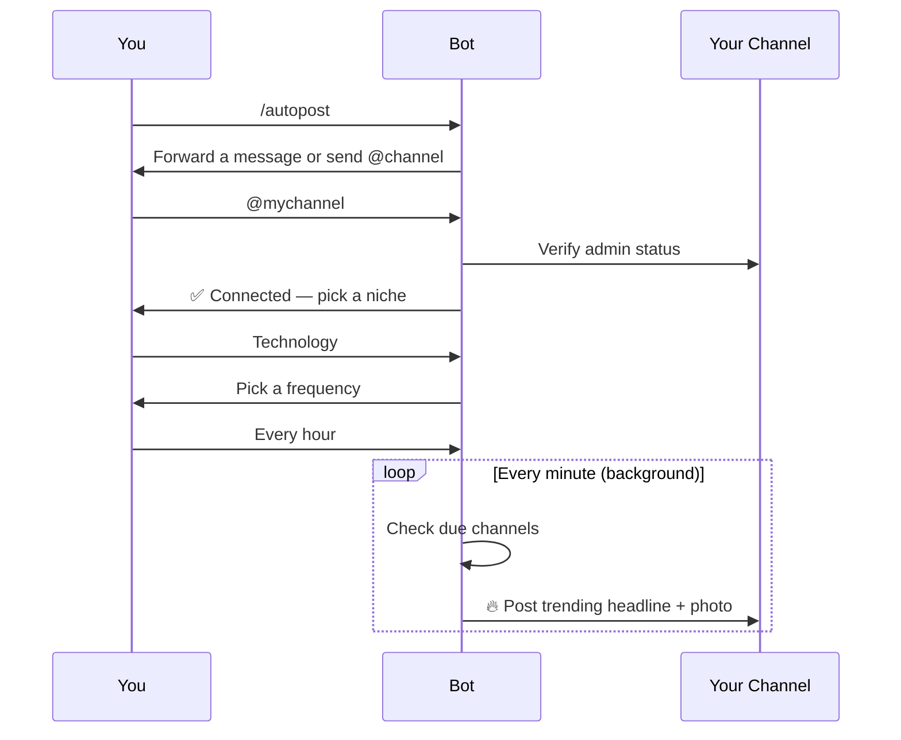

<div align="center">


<a href="https://t.me/philemon4u">
  
</a>

<br/>


<br/><br/>

<a href="https://render.com/deploy">
  
</a>
&nbsp;
<a href="https://bookmei.vercel.app/">
  
</a>
&nbsp;
<a href="https://t.me/philemon4u">
  
</a>

</div>

<br/>

> Replace the Render deploy link above with `https://render.com/deploy?repo=<your-github-repo-url>` once this is pushed to GitHub, so the button deploys **your** copy directly.

---

## 📖 Table of Contents

- [✨ What's Inside](#-whats-inside)
- [💬 Conversational Flows](#-conversational-flows)
- [🤖 Auto-Post to Your Channel](#-auto-post-to-your-channel-grow-views-on-autopilot)
- [🛠 Local Setup](#-local-setup)
- [☁️ Deploy to Render](#️-deploy-to-render-recommended-free-tier-works)
- [🎨 White-Labeling / Reselling](#-white-labeling--reselling-this-bot)
- [📦 Data](#-data)
- [🔑 API Keys](#-notes-on-api-keys)

---

## ✨ What's Inside


| Category | Commands |
|---|---|
| 🧩 Core content | `/sports` `/bible` `/game` `/design` `/motivation` `/influencer` `/shop` `/tech` `/others` |
| ⚡ Enhanced content | `/weather` `/youtube` `/tweet` `/hashtags` `/business` `/crypto` `/ai` `/music` `/podcast` `/news` `/joke` `/fact` |
| 💎 Premium | `/roast` `/story` `/recipe` `/fitness` `/travel` `/mindset` `/horoscope` `/dictionary` `/quiz` `/country` `/challenge` `/image` `/meme` |
| 🆕 New tools | `/football` · `/trending` · `/qr` · `/translate` · `/currency` · `/poll` · `/namecard` |
| 🤖 Automation | `/autopost` · `/autoposts` |
| ⚙️ Utilities | `/subscribe` `/reminder` `/setcity` `/settings` `/stats` `/links` `/start` `/help` |

<br/>

<div align="center">

</div>

## 💬 Conversational Flows

The bot **asks follow-up questions** instead of guessing what you want:

```
🌤  Tap "Weather"      → "Which region?"      → "Which city?"           → forecast
#️⃣  Tap "Hashtags"     → "Which platform?"    → "What's your niche?"    → hashtag sets
⚽  Tap "Football"     → "Which league?"                                → live scores
🔥  Tap "Trending"     → "Which category?"                              → news + photo
```

After any flow finishes, the bot **does not** re-show the whole menu — only a
small **🏠 Menu** button appears, so results stay clean and the full category
list only pops up when you actually ask for it.

---

## 🤖 Auto-Post to Your Channel (grow views on autopilot)

<div align="center">



</div>

1. Add the bot as an **admin** of your Telegram channel (with "Post Messages" permission).
2. Run `/autopost` in a private chat with the bot.
3. Forward any message from your channel (or type its `@username`).
4. Pick a niche: general, technology, business, entertainment, health, science, or sports.
5. Pick a posting frequency: 15 min, 30 min, 1h, 3h, 6h, 12h, or daily.
6. Done — a background job checks every minute and posts trending headlines
   (with a picture, when available) to your channel exactly on schedule.
   Manage everything with `/autoposts` (pause / resume / remove).

This runs **independently per user** — everyone who talks to the bot can
connect their own channel(s), niche, and schedule without affecting anyone
else's setup.

---

## 🛠 Local Setup

```bash
git clone <your-repo-url>
cd contentpro-bot
cp .env.example .env       # then fill in TELEGRAM_TOKEN
pip install -r requirements.txt
python bot.py
```

Get `TELEGRAM_TOKEN` from [@BotFather](https://t.me/BotFather) on Telegram.

---

## ☁️ Deploy to Render (recommended, free tier works)

**Option A — One-click via Blueprint**
1. Push this repo to GitHub.
2. In Render, choose **New → Blueprint**, point it at your repo (it reads `render.yaml`).
3. Set the `TELEGRAM_TOKEN` environment variable when prompted (kept out of git on purpose).
4. Deploy — Render runs `pip install -r requirements.txt` then `python bot.py`.

**Option B — Manual Web Service**
1. New → Web Service → connect your repo.
2. Build command: `pip install -r requirements.txt`
3. Start command: `python bot.py`
4. Add `TELEGRAM_TOKEN` (and optionally `WEBSITE_URL`, `CREATOR_USERNAME`, `BOOKING_URL` to rebrand).
5. Deploy.

> **Why "Web Service" and not "Background Worker"?** Render's free tier only
> supports Web Services, which require binding to `$PORT`. The bot talks to
> Telegram via long-polling (no inbound webhook needed), so `bot.py` starts a
> tiny built-in health-check HTTP server on `$PORT` automatically — nothing to
> configure. Free services sleep after inactivity; ping the service URL with
> [UptimeRobot](https://uptimerobot.com) or [cron-job.org](https://cron-job.org)
> every 5–10 minutes to keep it awake, or upgrade to a paid instance.

> **Python version:** pinned to `3.12.7` via `runtime.txt` / `PYTHON_VERSION`
> — this avoids a crash on Python 3.14 where `python-telegram-bot` 21.6 and
> APScheduler rely on event-loop behavior that 3.14 removed. If you ever bump
> dependencies, keep an eye on this.

Railway, Fly.io, and a plain VPS work the same way — install
`requirements.txt` and run `python bot.py` with `TELEGRAM_TOKEN` set. A
`Procfile` is included for Heroku-style platforms too.

---

## 🎨 White-Labeling / Reselling This Bot

Every bit of branding is an environment variable, so you can resell this same
codebase to multiple clients without touching the code:

| Variable | What it controls |
|---|---|
| `TELEGRAM_TOKEN` | Which bot account it runs as (each client needs their own bot from @BotFather) |
| `WEBSITE_URL` | The "🌐 Website" link shown in `/links`, `/start`, and every response footer |
| `CREATOR_USERNAME` | The Telegram handle shown as "💬 Chat with the creator" |
| `BOOKING_URL` | The "🗓 Book a site/service" link |
| `DB_PATH` | Where the SQLite database lives (give each client their own file/deploy) |

To sell to a new client: spin up a new Render service from the same repo,
give them a fresh `TELEGRAM_TOKEN`, and set their own `WEBSITE_URL` /
`CREATOR_USERNAME` / `BOOKING_URL` — that's the whole process.

---

## 📦 Data

`bot_data.db` is a SQLite database storing user settings, subscriptions,
command stats, and auto-post configuration. It's created automatically on
first run if it doesn't exist. Back it up periodically if you care about
retaining user preferences (`bot_data_backup.db` is included as an example).

---

## 🔑 Notes on API Keys

Everything works out of the box using free, keyless public endpoints
(Open-Meteo for weather, CoinGecko for crypto, ESPN for sports/football, a
NewsAPI mirror for news/trending, MyMemory for translation, Frankfurter for
currency, etc). `COINGECKO_API_KEY` and `NEWSAPI_KEY` are optional — add them
only if you hit rate limits and have paid keys for those services.

<br/>

<div align="center">


Made with ❤️ by **Drenchack** · [Website](https://dtc-official.vercel.app) · [Contact](https://t.me/philemon4u) · [Book a service](https://bookmei.vercel.app/)

</div>
